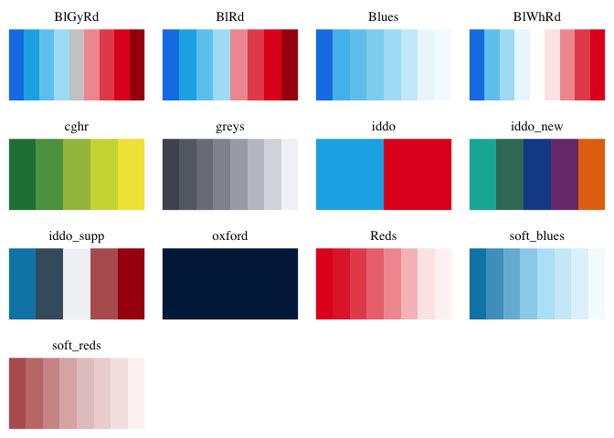
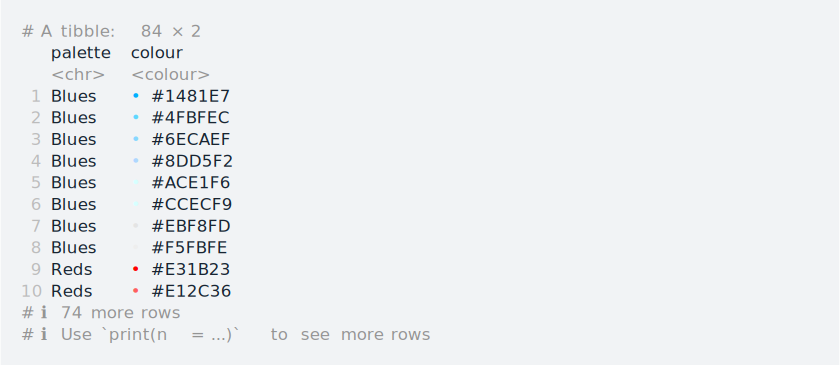
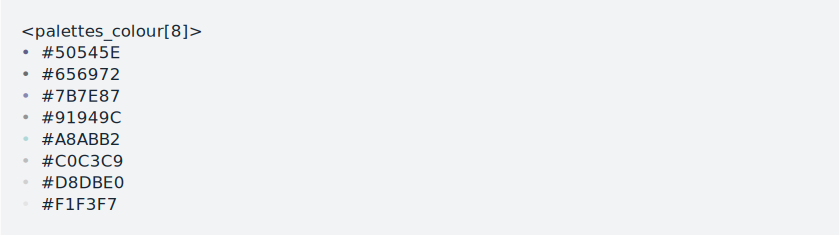

<!-- README.md is generated from README.Rmd. Please edit that file -->

# iddoPal

<!-- badges: start -->

<!-- badges: end -->

Colour palettes for R inspired by the [Infectious Diseases Data
Observatory](https://www.iddo.org).

This package was written using the `palettes` package, using the
accompanying
[guide](https://mccarthy-m-g.github.io/palettes/articles/creating-packages.html).
See also Gerry Ryan’s
[`idpalette`](https://github.com/idem-lab/idpalette).

## Included palettes



## Installation

You can install the development version of `iddoPal` from
[GitHub](https://github.com/) with:

``` r
# install.packages("devtools")
devtools::install_github("lu-harr/iddoPal")
```

## Usage

``` r
library(iddoPal)
```

`iddoPal` comes with 5 discrete colour palettes and 9 sequential colour
palettes, which can be accessed from the following R objects:

- `iddo_palettes_discrete` for discrete palettes
- `iddo_palettes_sequential` for sequential palettes
- `iddo_palettes` for all palettes

To preview the palettes in the console simply print them:

``` r
# this doesn't render nicely in .Rmd, but try in your own R session:
iddo_palettes_sequential
iddo_palettes_discrete 
```

To preview the palettes in the Plots pane use `plot()`:

``` r
plot(iddo_palettes_sequential)
```


To cast palettes to a tibble use `as_tibble()`:

``` r
as_tibble(iddo_palettes)
```



Palettes can be subset using `[`, `[[`, and `$`.

- To extract a single palette as a colour vector use `[[` or `$`:

  ``` r
  iddo_palettes_sequential[["BlWhRd"]]
  ```

  

  ``` r
  iddo_palettes_sequential$greys
  ```

  

- To get names of palettes use `names()`:

  ``` r
  names(iddo_palettes_sequential)
  #> [1] "Blues"      "Reds"       "soft_blues" "soft_reds"  "greys"     
  #> [6] "BlWhRd"     "BlRd"       "BlGyRd"     "BlGyRdPlus"
  ```

## Demonstration

`iddo_palettes` may be then be used for R Base Graphics or `ggplot2`
visualisations:

``` r
library(ggplot2)

ggplot(faithfuld,
       aes(waiting, eruptions)) +
  geom_raster(
    aes(fill = density)
  ) +
  scale_fill_gradientn(
    colours = iddo_palettes$BlWhRd
  )
```


``` r

# This isn't very elegant but I promise Base Graphics is usually the most 
# straightforward way of doing things ! I promise !
pal <- iddo_palettes$iddo_new[3:5]

plot(iris$Sepal.Length, iris$Petal.Length, 
     col = alpha(pal[as.numeric(as.factor(iris$Species))], 0.5),
     pch = 16, xlab="Sepal Length", ylab="Petal Length")
legend("bottomright", 
       fill = pal,
       levels(as.factor(iris$Species)))
```


I’ve found the `BlGyRd` palette to be very handy for cases where we need
a diverging palette with clear extremes and midpoint, but I’ve added
`BlGyRdPlus` for even more variation either side of the middle:

``` r
library(ggplot2)
library(dplyr)
#> 
#> Attaching package: 'dplyr'
#> The following objects are masked from 'package:stats':
#> 
#>     filter, lag
#> The following objects are masked from 'package:base':
#> 
#>     intersect, setdiff, setequal, union
library(cowplot)

p1 <- ggplot(faithfuld %>%
         mutate(density = density - min(density),
                density = density / max(density)),
       aes(waiting, eruptions)) +
  geom_raster(
    aes(fill = density)
  ) +
  scale_fill_gradientn(
    colours = iddo_palettes$BlGyRd
  )

p2 <- ggplot(faithfuld %>%
         mutate(density = density - min(density),
                density = density / max(density)),
       aes(waiting, eruptions)) +
  geom_raster(
    aes(fill = density)
  ) +
  scale_fill_gradientn(
    colours = iddo_palettes$BlGyRdPlus
  )

plot_grid(p1, p2)
```


… let’s see how that goes

## License

CC0
